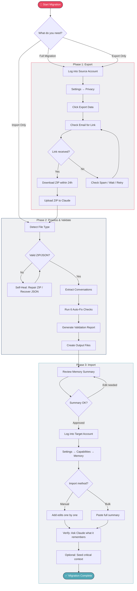
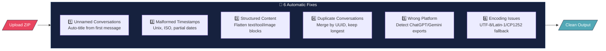

# Claude Migrator

**Migrate your Claude chat history, memory, and context between accounts.**

Anthropic doesn't support direct account-to-account chat transfer. This tool bridges that gap — export from one Claude account, parse and validate your data, and import context into another account (personal → team, team → team, etc).

Built by St1ng3r254. Works for anyone with two Claude accounts.

---

## How It Works

### High-Level Flow


### Detailed Process Flow



### Self-Healing Pipeline



---

## Quick Start

### Option A: Use the Claude Skill (Recommended)

1. Install the `claude-account-migrator.skill` file in your Claude account
2. Start a new conversation and say: **"I need to migrate my Claude data"**
3. Claude walks you through everything step by step

### Option B: Run the Parser Manually

```bash
# Clone this repo
git clone https://github.com/YOUR_USERNAME/claude-migrator.git
cd claude-migrator

# Run the parser on your export file
python3 scripts/parse_claude_export.py your-export.zip ./output

# Review output
ls output/
# index.md  memory-summary.md  stats.md  conversations/
```

No dependencies required — pure Python 3.8+ standard library.

---

## Output Structure

```
output/
├── index.md                        # Master index — all conversations with dates, topics, message counts
├── memory-summary.md               # Context summary ready to import into target account
├── stats.md                        # Usage statistics with monthly activity chart
└── conversations/                  # Individual Markdown files
    ├── 2025-06-15_server-build.md
    ├── 2025-07-01_network-config.md
    └── ...
```

---

## Staff Migration Guide

### Step 1: Export from Your Personal Account

1. Go to [claude.ai](https://claude.ai) and log into your **personal** account
2. Click your initials (bottom-left) → **Settings** → **Privacy**
3. Click **"Export data"**
4. Check your email, download the ZIP within 24 hours

### Step 2: Process Your Export

Upload the ZIP to a Claude conversation (with the skill installed) or run the parser script.

### Step 3: Review the Memory Summary

Open `memory-summary.md` and remove anything outdated, personal, or irrelevant.

### Step 4: Import into Team Account

1. Log into your **team** Claude account
2. Go to **Settings → Capabilities → Memory → View and edit your memory**
3. Add each relevant memory edit, or use the bulk Import Memory feature
4. Verify by asking Claude: *"What do you remember about me?"*

### Step 5: Archive

Upload the `conversations/` folder to Google Drive for searchable reference.

---

## Process Charts

### What Gets Migrated

| Data Type | Migrated? | Method |
|-----------|-----------|--------|
| Memory & Preferences | ✅ Yes | Imported into target account memory |
| Chat History (full text) | ✅ Yes | Archived as searchable Markdown files |
| Recurring Topics & Context | ✅ Yes | Summarized in memory edits |
| Tool Usage Patterns | ✅ Yes | Documented in export summary |
| Live Conversation Sessions | ❌ No | Cannot continue threads in new account |
| File Attachments | ❌ No | Not included in Claude exports |

### Supported Export Formats

| Format | Detected? | Notes |
|--------|-----------|-------|
| Claude ZIP export | ✅ | Primary format — fully supported |
| Claude JSON (direct) | ✅ | Individual JSON files from export |
| ChatGPT export | ⚠️ | Detected and warned — parsed if possible |
| Gemini export | ⚠️ | Basic detection |
| Other formats | ❌ | Will report "no conversations found" |

### Troubleshooting

| Problem | Solution |
|---------|----------|
| No export button | Go to Settings → Privacy (available on all plans) |
| Email never arrives | Check spam, verify email in Settings → Account, wait up to 4h |
| Download link expired | Request new export (Settings → Privacy) |
| ZIP won't open | Re-download, or parser auto-repairs if partially corrupted |
| No conversations found | Export may only contain metadata — verify you had saved chats |
| Garbled characters | Parser auto-fixes encoding (UTF-8/Latin-1/CP1252 fallback) |
| Memory not appearing | Allow up to 24 hours after import |
| Wrong things remembered | Edit in Settings → Capabilities → Memory → View and edit |

---

## Repository Structure

```
claude-migrator/
├── README.md                           # This file
├── LICENSE                             # MIT License
├── SKILL.md                            # Claude skill file (single-file wizard)
├── scripts/
│   └── parse_claude_export.py          # Standalone parser script
└── docs/
    ├── flow-diagram.md                 # Mermaid source for flow diagrams
    ├── staff-migration-guide.md        # Printable staff guide
    └── process-architecture.md         # Technical architecture details
```

---

## License

MIT — use freely, modify as needed.

---

## Contact

St1ng3r254
