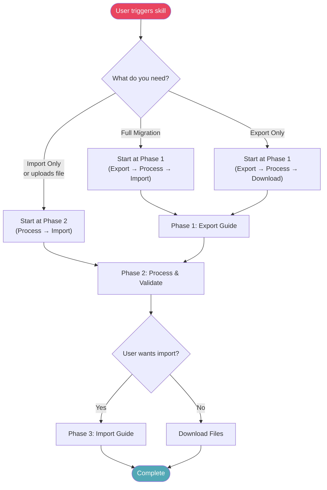
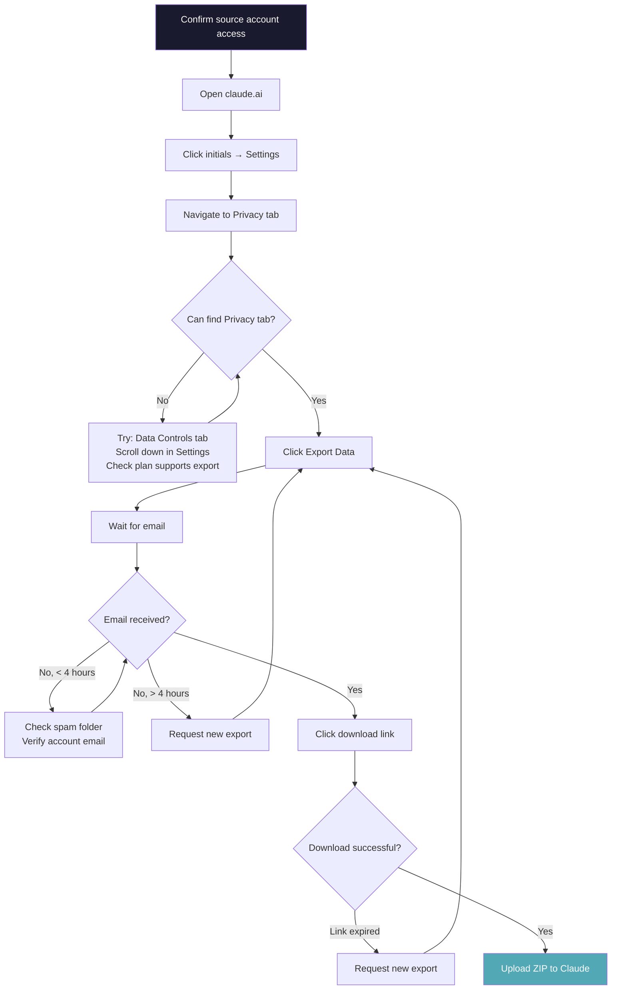
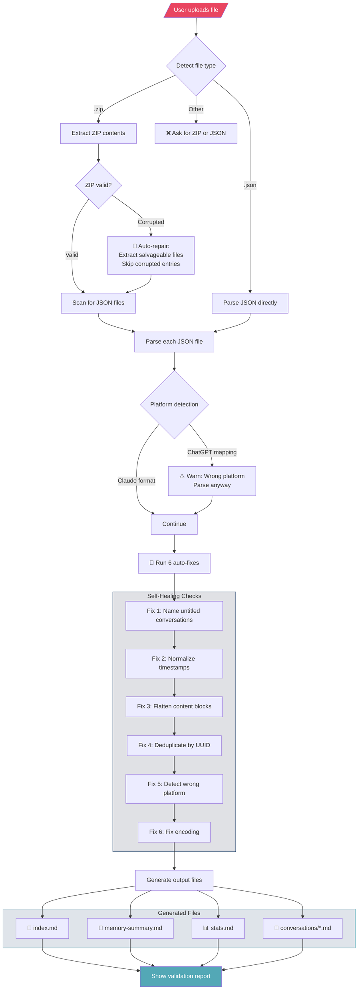
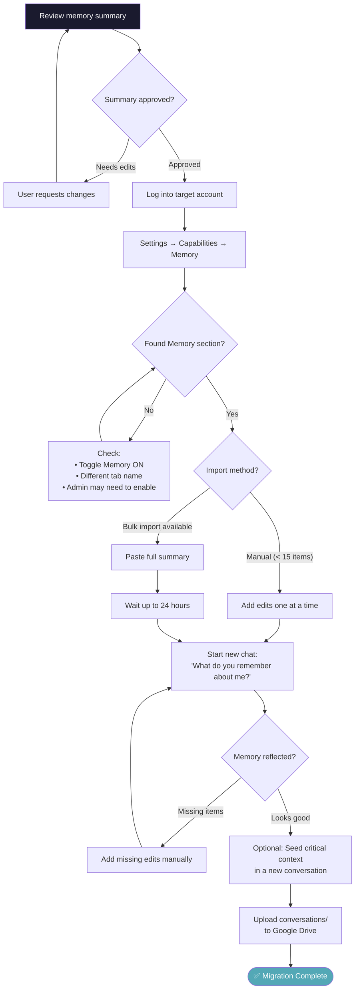
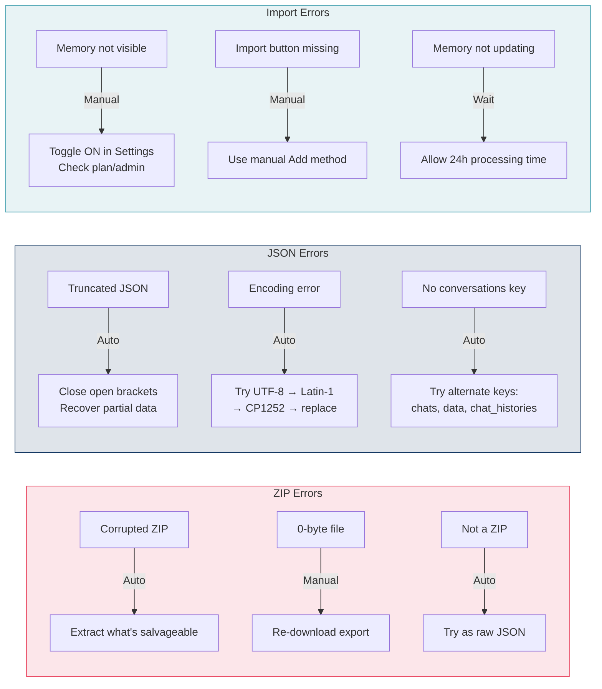

# Flow Diagrams — Claude Migrator

All diagrams use [Mermaid](https://mermaid.js.org/) syntax and render natively on GitHub.

---

## 1. User Decision Tree

---

## 2. Export Process (Phase 1)

---

## 3. Processing Pipeline (Phase 2)

---

## 4. Import Process (Phase 3)

---

## 5. Error Recovery Flows

